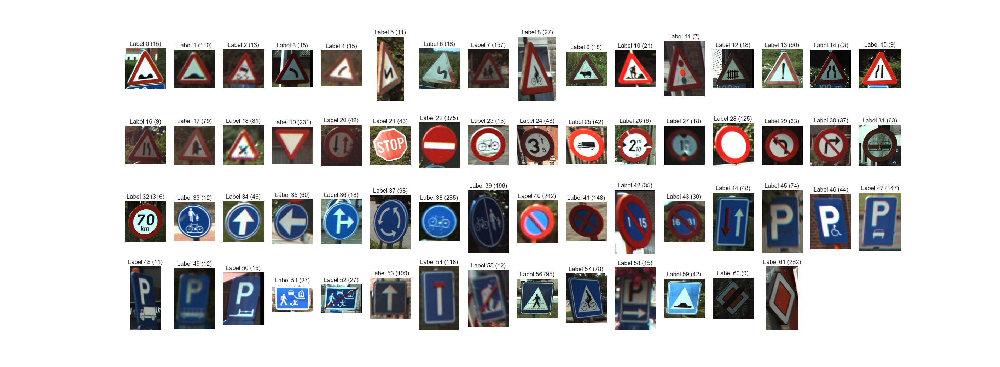
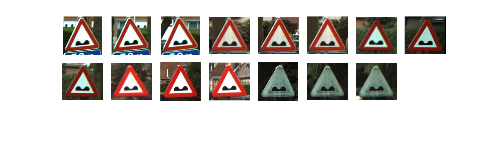
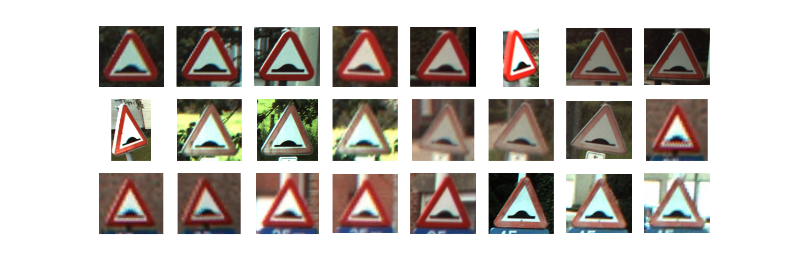
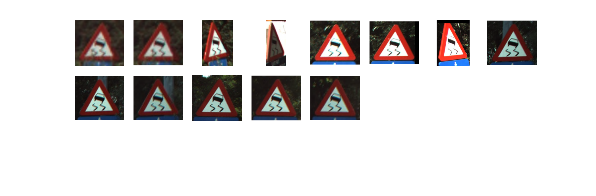
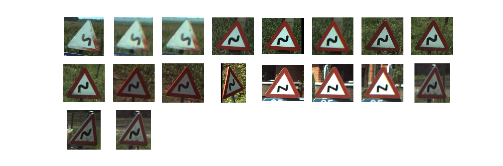
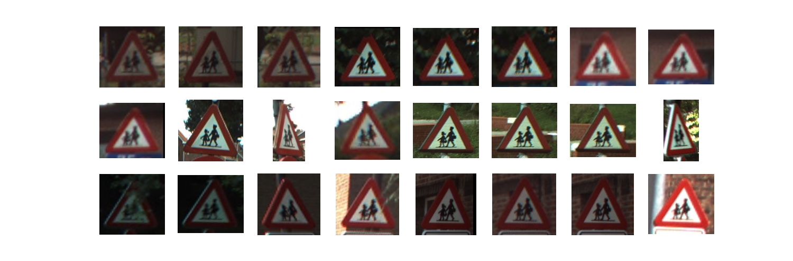

# Traffic signs recognition

This repository is the first part of a tutorial to build a deep learning model for traffic sign recognition. The goal is to build a model that can detect and classify traffic signs in a video stream taken from a moving car.

# Table of contents
1. [Project installation](#1-project-installation)
2. [Project description](#2-project-description)  
3. [Results and learnings](#3-results-and-learnings)

# 1. Project installation
[[back to the top]](#table-of-contents)

### Installation steps (tested on Ubuntu) ###

Install GIT

*sudo apt-get install git*

Get the source code
 
*mkdir traffic-signs-keras*

*cd traffic-signs-keras*

*git init*

*git clone https://github.com/imironica/traffic-signs-keras.git*

Install latest python packages from *requirements.txt* file

*pip3 install -r requirements.txt*

# 2. Project description 
[[back to the top]](#table-of-contents)

Trainging Dataset
We are using the Belgian Traffic Sign Dataset. Go to http://btsd.ethz.ch/shareddata/ and download the training and test data. 
There is a lot of datasets on that page, but you only need the two files listed under BelgiumTS for Classification (cropped images)":

BelgiumTSC_Training (171.3MBytes)
BelgiumTSC_Testing (76.5MBytes)
After downloading and expanding the files, your directory structure should look something like this:
/Training/
/Testing/

Each of the two directories above has 62 sub-directories named sequentially from 00000 to 00062. The directory name represents the code (or label) and the images inside the directory are examples of that label.
The Training directory contains sub-directories with sequental numerical names from 00000 to 00061. The name of the directory represents the labels from 0 to 61, and the images in each directory represent the traffic signs that belong to that label. The images are saved in the not-so-common .ppm format, but luckily, this format is supported in the skimage library.

Image examples from database
 
 
 
 
 
   

# 3. Results and learnings
[[back to the top]](#table-of-contents)
 
